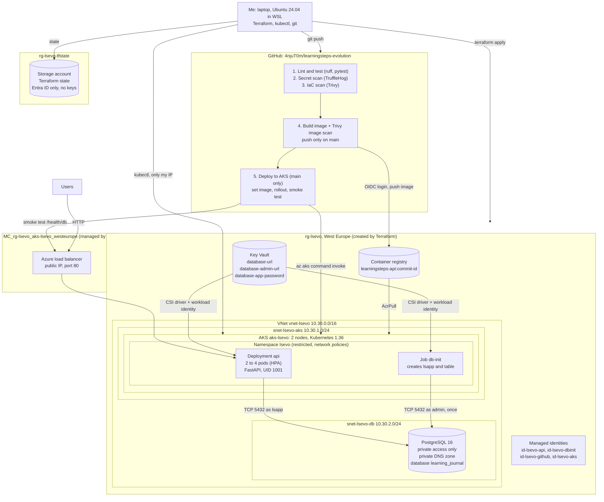

# LearningSteps Part 2: From Hand-Built VMs to an Automated AKS Deployment

LearningSteps is a FastAPI app with a PostgreSQL database for keeping a daily learning journal (what I worked on, what I struggled with, and what I plan next). In Part 1 I deployed it on two virtual machines that I built by hand in the Azure Portal. In this part I run the same app in a completely new way:

- the Azure resources are created with **Terraform**
- the app is packaged as a **Docker** image
- it runs on **Azure Kubernetes Service (AKS)**, with the database password coming from **Azure Key Vault**
- **GitHub Actions** lints, tests, scans, builds and deploys every change, and stops when a scan finds a High or Critical problem

Key facts:

- Repository: `4njuT0m/learningsteps-evolution`, started from the original LearningSteps code
- Part 1 repository: [`4njuT0m/learningsteps-azure-Project`](https://github.com/4njuT0m/learningsteps-azure-Project)
- Region: West Europe
- API (while the environment is running): `http://108.142.54.96/docs`

## Contents

- [Architecture](#architecture)
- [Repository layout](#repository-layout)
- [The pipeline](#the-pipeline)
- [What I did](#what-i-did)
- [Testing](#testing)
- [Security decisions](#security-decisions)
- [Challenges](#challenges)
- [Known issues](#known-issues)
- [Key learnings](#key-learnings)
- [How to rebuild the environment](#how-to-rebuild-the-environment)

## Architecture



How to read the diagram:

- **Request path.** A user calls the public IP of the Azure load balancer. The load balancer sends the request to one of the API pods. The pod talks to PostgreSQL in the database subnet over the private network, as the app user `lsapp`. The database has no public address, so it cannot be reached from the internet at all.
- **Secrets.** The pods never get the database password from Git or from Kubernetes. The Key Vault CSI driver mounts it as a file, using the pod's own managed identity (workload identity). The API pods can only read `database-url`, and the one-time `db-init` job can only read the admin URL and the app password.
- **Release path.** I push to GitHub. The pipeline runs lint and tests and the two scans. It builds the image and scans it, and only on `main` it logs in to Azure with OIDC, pushes the image to the registry and runs `kubectl set image` inside the cluster with `az aks command invoke`. The nodes pull the new image from the registry, and the pipeline checks `/health/db` on the public IP.
- **Infrastructure path.** Everything in `rg-lsevo` is created from my laptop with Terraform. The state lives in a separate resource group, so `terraform destroy` never removes it. The AKS API server and the Key Vault only accept my IP from outside Azure.
- **Managed by AKS.** AKS creates its own resource group (`MC_rg-lsevo_aks-lsevo_westeurope`) for the load balancer, its public IP and the node machines. The node machines are still connected to `snet-lsevo-aks`.

## Repository layout

| Path | What it is |
| --- | --- |
| `api/` | The FastAPI app. The original code with the unfinished endpoints completed. |
| `tests/` | 11 pytest tests that use an in-memory fake instead of PostgreSQL. |
| `ruff.toml`, `requirements-dev.txt` | Lint rules and the test tools. |
| `Dockerfile`, `.dockerignore` | The two-stage image build. |
| `compose.yaml` | Runs the API with PostgreSQL 16 on my laptop. |
| `infra-terraform/` | All Azure resources of the project. |
| `k8s-manifests/` | Namespace, database setup job, the app, and network policies. |
| `.github/workflows/build-scan-deploy.yml` | The pipeline. |
| `.trufflehog-exclude.txt` | The one file the secret scan skips, with the reason. |
| `docs/screenshots/` | All screenshots of this writeup. |

## The pipeline

| Job | Runs on | What it does |
| --- | --- | --- |
| Lint and test | every push and pull request | ruff and pytest |
| Secret scan (TruffleHog) | every push and pull request | scans every commit in the history for credentials |
| IaC scan (Trivy) | every push and pull request | scans the Terraform files, the Kubernetes manifests and the Dockerfile, fails on High or Critical |
| Build, scan and push image | after the three jobs above | builds the image, scans it with Trivy (fails on fixable High or Critical), pushes it to ACR only on `main` |
| Deploy to AKS | `main` only | sets the new image with `az aks command invoke`, waits for the rollout, then checks `/health/db` on the public IP |

## What I did

### 1. Computer setup

- My existing WSL distro was Ubuntu 26.04.1. It has no `python3.12` package, and the project uses Python 3.12, so I installed Ubuntu 24.04 next to it with `wsl --install -d Ubuntu-24.04`. All Part 2 work runs there.
- Enabled Docker Desktop's WSL integration for Ubuntu-24.04 and checked that Docker works from inside it.
- Connected VS Code to Ubuntu-24.04 with the WSL extension.
- Installed Git, Python 3.12, GitHub CLI, Azure CLI, Terraform, kubectl, kubelogin and Trivy inside Ubuntu. `which` showed that all of them are the Linux versions.
- Signed in to GitHub CLI with the browser code.


### 2. Repository and API

- Created a new public repository `learningsteps-evolution` from the original LearningSteps code (commit `f4b0962`) with `gh repo create`. The original repository stays as a read-only remote called `upstream`.
- The original code was not finished: GET and DELETE by ID returned 501, PATCH lost the fields that were not sent, and logging was not set up.
- Implemented GET and DELETE by ID. Both return 404 for an unknown ID.
- Fixed PATCH with a new `EntryUpdate` model. All fields are optional with the same 256-character limit, only the sent fields change, and an empty body returns 400.
- Set up console logging, with a message when the app starts and stops.
- Added `/health` (the API is running) and `/health/db` (the database answers within 3 seconds) for the Kubernetes health checks.
- Wrote 11 tests with pytest. They use a small in-memory fake instead of PostgreSQL, so they run without a database. The lint rules are in `ruff.toml` (pycodestyle errors and pyflakes).
- Worked on the branch `feature/complete-api` and merged it with pull request #1.


### 3. Container

- Removed `aiohttp`, `sqlalchemy` and `psycopg2-binary` from the requirements. The code never imports them.
- Listed the four packages the code uses in `api/requirements.in`, installed them in a clean virtual environment and saved the exact versions with `pip freeze` to `api/requirements.txt`, so every build gets the same versions.
- Wrote a `Dockerfile` with two stages. The first stage installs the packages into a virtual environment. The second stage, based on `python:3.12-slim` (Debian 13), only gets that environment and the `api` code.
- The app runs as the system user `api` (UID 1001) with no login shell. The code files belong to root, so the app cannot change them.
- Added a `.dockerignore` so `.git`, `.env`, `.venv` and the tests are not sent to the image build.
- Wrote `compose.yaml` to run the API with PostgreSQL 16 on my laptop. PostgreSQL creates the `entries` table from `database_setup.sql`, the API starts only when the database is healthy, the port only listens on `127.0.0.1`, and the data is kept in the volume `db-data`.
- Put the local database user and a random password (`openssl rand -hex 16`) in `.env`. Git ignores it and only my user can read it.
- `/health` and `/health/db` answered OK, and `id` inside the container showed `uid=1001(api)`.
- Tested CRUD with curl. PATCH changed only `work` and kept the other fields. The entry was still there after restarting the API and after `docker compose down` and `up`. After DELETE, GET returned 404. Swagger opened at `localhost:8000/docs`.
- Scanned the image with Trivy (High and Critical, only findings that have a fix). The first scan found one HIGH vulnerability, CVE-2026-103111 in `libpcre2-8-0` from the Debian base image (installed 10.46-1~deb13u2, fixed in 10.46-1~deb13u3), and exited with code 1. Debian already had the fixed version, so I added `apt-get upgrade` to the second stage and rebuilt with `--pull`. The next scan found nothing and exited with code 0. The Python packages had no findings in both scans.
- Merged it with pull request #2.


### 4. Azure preparation

- Signed in to Azure CLI inside Ubuntu with `az login --use-device-code`. My account is Owner of the subscription, which is needed because Terraform creates role assignments.
- Compared Germany West Central and West Europe before building anything:
  - vCPU quota: Germany West Central had 4 of 10 in use by my Part 1 VMs, West Europe 0 of 10. The cluster needs 4 for two `Standard_D2s_v6` nodes and 2 more during an upgrade.
  - `Standard_D2s_v6` is available in both regions, but not in all zones (zone 2 in Germany West Central, zones 2 and 3 in West Europe).
  - AKS offers Kubernetes 1.35 to 1.37 in both.
  - PostgreSQL `Standard_B1ms` was only offered in West Europe.
- Chose West Europe, because AKS and the database have to be in the same region. The AKS nodes are created without zones.
- Registered the resource providers for AKS, Container Registry, PostgreSQL, Key Vault, Managed Identity, Network, Storage and Compute.
- Chose `lsevo` (LearningSteps Evolution) as the prefix for all resource names.
- Created the resource group `rg-lsevo-tfstate` with the storage account `stlsevotfd27660` and the container `tfstate` for the Terraform state. It is separate from the project resources, so `terraform destroy` never deletes its own state.
- The storage account only allows HTTPS with TLS 1.2, no public blobs and no account keys. I gave myself Storage Blob Data Contributor on this storage account only.
- Turned on blob versioning and 7 days of soft delete for blobs and containers, and put a `CanNotDelete` lock on the resource group.


### 5. Terraform

- Wrote my own Terraform in `infra-terraform/` with the AzureRM provider 5.8.0, plus `random` 3.9.1 and `time` 0.14.2.
- The state is stored in `stlsevotfd27660`, and Terraform reaches it with my Entra ID sign-in. The subscription ID comes from the `ARM_SUBSCRIPTION_ID` environment variable, and my IP and GitHub IDs are in `terraform.tfvars`, which Git ignores. No subscription ID or IP is in the code.
- Added Terraform rules to `.gitignore` (`.terraform/`, state, `*.tfvars`, plan files). The provider lock file is committed.
- What it creates in `rg-lsevo`:
  - VNet `vnet-lsevo` (10.30.0.0/16) with `snet-lsevo-aks` (10.30.1.0/24) and `snet-lsevo-db` (10.30.2.0/24, delegated to PostgreSQL), and a private DNS zone for the database.
  - A container registry (Basic, admin user off).
  - AKS `aks-lsevo`: 2 × `Standard_D2s_v6`, Kubernetes 1.36, no zones, Azure CNI overlay with Cilium for network policies. Sign-in only with Entra ID (local accounts off), the API server only accepts my IP, and workload identity and the Key Vault CSI driver are on.
  - PostgreSQL 16 (B1ms) with private access only, the database `learning_journal`, and logging of connections and checkpoints plus connection throttling.
  - A Key Vault in RBAC mode with purge protection. Only my IP and the AKS subnet can reach it. It holds three secrets: `database-url`, `database-admin-url` and `database-app-password`.
  - Identities `id-lsevo-api` and `id-lsevo-dbinit` for the pods. Each one can only read the secrets it needs.
- `terraform fmt -check` and `terraform validate` passed, and Trivy found no High or Critical misconfigurations (exit code 0).
- `terraform apply` added 33 resources. The plan file was deleted after the apply because it contains the generated passwords.
- `az keyvault secret list` showed the three secret names from my laptop, so the vault's network rule and my role work.
- A new `terraform plan` after the apply showed 12 changes. Azure had added a `created-on` tag to 11 resources and a `Microsoft.Storage` service endpoint to the database subnet. I told Terraform to ignore the `created-on` tag and added the endpoint to the code. After that, the plan showed no changes.
- Merged it with pull request #3.


### 6. Cluster access, database setup and first image

- Connected `kubectl` to the cluster with `az aks get-credentials` and `kubelogin`, so it signs in with my Azure CLI login. Both nodes are Ready with Kubernetes 1.36.4 on Ubuntu 24.04.5, and their IPs (10.30.1.4 and 10.30.1.5) are from `snet-lsevo-aks`. My kubectl 1.37.1 works with the 1.36.4 server.
- Wrote `k8s-manifests/namespace.yaml`: the namespace `lsevo` with the Pod Security level `restricted`.
- Wrote `k8s-manifests/db-init.yaml` for the one-time database setup:
  - the service account `lsevo-dbinit`, linked to the identity `id-lsevo-dbinit`
  - a SecretProviderClass that mounts only `database-admin-url` and `database-app-password` from Key Vault
  - a Job that runs `psql` once as a non-root user (UID 999) with a read-only filesystem. It creates the user `lsapp` with the password from Key Vault, creates the `entries` table and its indexes, and gives `lsapp` only SELECT, INSERT, UPDATE and DELETE on the table. It can be run again without breaking anything.
- The Key Vault name, tenant ID and client ID are not in the file. I fill them in from `terraform output` with `envsubst` when applying.
- The job pod got the workload identity token (`azure-identity-token` volume), pulled `postgres:16`, and the job completed in 21 seconds. Its log shows CREATE ROLE, ALTER ROLE, CREATE TABLE, two CREATE INDEX, three GRANT and "Database setup finished".
- Built the image with the short commit ID as tag (`ee5ab97`). Trivy found no fixable High or Critical vulnerabilities (exit code 0), and only then I pushed it to the registry after `az acr login`.
- Merged it with pull request #4.


### 7. The app in Kubernetes

- Wrote `k8s-manifests/api.yaml` for the app:
  - the service account `lsevo-api`, linked to the identity `id-lsevo-api`
  - a SecretProviderClass that mounts only `database-url` from Key Vault
  - the ConfigMap `api-config` with `UVICORN_LOG_LEVEL` (uvicorn reads variables that start with `UVICORN_`)
  - the Deployment `api`. It runs as UID 1001 with a read-only filesystem, no Linux capabilities, and CPU and memory limits. Liveness checks `/health`, readiness checks `/health/db`.
  - the Service `api` of type LoadBalancer (port 80 to the pods' port 8000)
  - a HorizontalPodAutoscaler for 2 to 4 pods at 70% CPU
- When the container starts, it reads the database URL from the mounted Key Vault file into `DATABASE_URL`. That way the URL is never stored as a Kubernetes Secret.
- Filled in the image, client ID, Key Vault name and tenant ID with `envsubst` and applied it. The deployment showed 2/2 with two pods Running, and the HPA showed 2 to 4 pods at 4% of the 70% CPU target.
- Inside the pod, `id` shows `uid=1001(api)`, and the namespace has no Kubernetes Secrets ("No resources found"). The Service got a public IP on port 80, Swagger opened, and GET /entries returned 200.
- Tested CRUD on the public IP with curl: create, read, PATCH (only `work` changed, the other fields were kept), DELETE, and then GET returned 404.
- Wrote `k8s-manifests/network-policy.yaml`, enforced by Cilium:
  - everything in `lsevo` is blocked by default
  - the API accepts traffic on port 8000
  - the API and the setup job may only use DNS and reach PostgreSQL in 10.30.2.0/24 on port 5432
- With the policies applied, a request from the API pod to the node's metadata service (169.254.169.254) was blocked (URLError), while `/health/db` still answered "reachable" and GET /entries still worked.
- Merged it with pull request #5.


### 8. GitHub Actions pipeline

- Added `infra-terraform/github.tf` for the pipeline identity `id-lsevo-github`. The plan showed 6 to add and 0 to change, and the apply added 6 resources.
- The federated credential only trusts workflow runs on the `main` branch of my repository. My repository was created after 15 July 2026, so GitHub puts the numeric owner and repository IDs into the token subject (`repo:4njuT0m@<id>/learningsteps-evolution@<id>:ref:refs/heads/main`). I got the two IDs with `gh api` and put them into `terraform.tfvars`.
- Roles of the pipeline identity:
  - AcrPush on the registry
  - a custom role on the cluster that can only read it and run `az aks command invoke`
  - Azure Kubernetes Service RBAC Writer on the `lsevo` namespace only
- The AKS API server only accepts my IP, so the pipeline deploys with `az aks command invoke`. Azure runs the `kubectl` command inside the cluster.
- Saved `AZURE_CLIENT_ID`, `AZURE_TENANT_ID` and `AZURE_SUBSCRIPTION_ID` as GitHub secrets, and `ACR_NAME`, `AKS_NAME`, `AKS_RESOURCE_GROUP` and `APP_URL` as variables.
- Wrote `.github/workflows/build-scan-deploy.yml` (see [The pipeline](#the-pipeline)). The build only starts when lint, tests and both scans have passed. The actions are pinned to commit IDs, and the scanners run as fixed container versions (Trivy 0.75.0, TruffleHog 3.97.9).
- The original `.env-sample` has a placeholder password for a local Docker database. I excluded only that file in `.trufflehog-exclude.txt`, with the reason written in the file, so it does not fail every run.
- Pull request #6: the push run and the pull request run both passed (10 checks). Lint, tests, both scans and the image build were green, and Deploy to AKS was skipped because it was not `main`.
- After the merge (`d66a86c`), the run on `main` passed all five jobs in 2 minutes 11 seconds. The deploy job updated the image, waited until both new pods were rolled out, and the smoke test answered `{"status":"ok","database":"reachable"}`.
- Afterwards the deployment ran `learningsteps-api:d66a86c`, the registry had the tags `d66a86c` and `ee5ab97`, and `/health/db` answered "reachable".


### 9. Demonstrations

- **Code change goes live automatically.** I added `version="2.0.0"` to the FastAPI app in a branch and merged it with pull request #7. The run on `main` passed all five jobs in 2 minutes 7 seconds. After that the deployment ran `learningsteps-api:1dbd537` (the merge commit), `/openapi.json` reported version 2.0.0, and Swagger on the public IP showed the 2.0.0 badge. I did not run any command against the cluster for this.
- **A vulnerable package is blocked.** In the branch `demo/vulnerable-package` I added `urllib3==1.26.4` to `api/requirements.txt` (pull request #8). Lint, tests and both scans passed, but the image scan found 8 HIGH vulnerabilities in urllib3 1.26.4 (for example CVE-2021-33503 and CVE-2023-43804) and failed with exit code 1. The login, push and deploy steps did not run. I closed the pull request without merging.
- **Insecure Terraform is blocked.** In the branch `demo/insecure-terraform` I removed the `api_server_access_profile` block from `aks.tf` (pull request #9). The IaC scan failed with AZU-0041 (CRITICAL): the cluster does not limit API access to specific IP addresses. The build and deploy jobs were skipped, so nothing was built. I never ran Terraform on this branch and closed the pull request without merging.
- **Self-healing.** I created an entry, deleted one of the two API pods, and Kubernetes started a new one right away. After both pods were Ready again (one 3 minutes old, the other 49 minutes), the same entry came back through the API, because the data is in PostgreSQL and not in the pod.
- **Autoscaling.** With load from inside the cluster, the CPU went to 117% of the 70% target, and the HPA scaled the API from 2 to 4 pods (its maximum).


### 10. Destroy and recreate

- Ran `terraform plan -destroy` and applied it. Terraform destroyed all 39 resources. Afterwards only `rg-lsevo-tfstate` was left, and the old public IP gave no answer.
- Ran `terraform plan` and `terraform apply` again. The first apply stopped at the Key Vault with `SubnetsNotProvisioned`, because AKS was still updating `snet-lsevo-aks`. Everything before it had been created. I added `depends_on` on the AKS cluster to the Key Vault, and the second apply added the missing 9 resources.
- After that the state had all 39 resources again (40 entries with the one data source), and `terraform plan` showed no changes (exit code 0).
- The new resources got a new random suffix, so the registry, Key Vault and database have new names. The new registry was empty, so I built, scanned and pushed `learningsteps-api:1dbd537` from my laptop again.
- Connected `kubectl` to the new cluster, ran the database setup job again and applied `api.yaml` and `network-policy.yaml`.
- The deployment showed 2/2, the Service got the new public IP 108.142.54.96, `/health/db` answered "reachable" and the API reported version 2.0.0. Swagger opened on the new IP.
- Updated the GitHub secret `AZURE_CLIENT_ID` and the variables `ACR_NAME` and `APP_URL` for the new environment and started the pipeline by hand.
- The manual runs first failed because of a GitHub Actions incident (see [Challenges](#challenges)). After GitHub recovered, the deploy job failed once more because the cluster was stopped (`PowerState=Stopped`). I started it again with `az aks start` and re-ran the failed jobs. Run #14 on `main` (`workflow_dispatch`, commit `1dbd537`) then passed all five jobs: lint and test, both scans, the image build and the deploy to the new cluster. The OIDC login used the new pipeline identity, and the token subject contained the numeric IDs as expected.


## Testing

| What | How | Result |
| --- | --- | --- |
| API logic | 11 pytest tests with an in-memory fake database, locally and in every pipeline run | all passed |
| Lint | ruff with pycodestyle errors and pyflakes | no findings |
| Container | Docker Compose with PostgreSQL 16: health checks, CRUD, restart, `down` and `up` | all worked, data kept |
| Image | Trivy, High and Critical with a fix | one HIGH found and fixed, then clean |
| Terraform | `fmt`, `validate`, Trivy config scan, `plan` after every apply | clean, no drift after the fixes |
| Cloud | health checks, CRUD and Swagger on the public IP | all worked |
| Network policies | request from the pod to the metadata service, then `/health/db` | metadata blocked, database reachable |
| Pipeline gates | a vulnerable package and an insecure Terraform change in pull requests | both blocked before build or deploy |
| Resilience | deleted pod, load test, destroy and recreate | pod replaced, HPA to 4 pods, environment rebuilt from code |

## Security decisions

**Identity and access**

- The pipeline has no stored Azure password or key. It logs in with OIDC, and only runs on `main` of my repository are trusted. The numeric IDs in the subject mean a renamed or re-created repository with the same name cannot use it.
- The pipeline identity can only push images, run commands on the cluster, and change objects in the `lsevo` namespace.
- Each pod identity can read only its own secrets. The role is assigned on the single secret, not on the whole vault.
- The registry admin user is off. The AKS nodes can only pull images (AcrPull).
- Sign-in to the cluster works only with Entra ID. There are no local cluster accounts.

**Network**

- The AKS API server only accepts my IP. The pipeline deploys through `az aks command invoke` instead of opening the API.
- The database has no public access. It is only reachable inside the VNet.
- The Key Vault only accepts my IP and the AKS subnet, and purge protection is on.
- Network policies block all pod traffic by default. The app pods can only use DNS and reach the database, so they cannot reach the internet or the node's metadata service.

**Secrets**

- The database URL is only mounted as a file from Key Vault and read when the container starts. It is not a Kubernetes Secret, and no Key Vault names, tenant ID or client IDs are written in the manifests.
- The app uses its own database user, `lsapp`, which can only read and change rows in `entries`. The admin account is only used by the one-time setup job.
- The Terraform state contains the database passwords, so it is not kept on my laptop or in Git. It is in Azure Storage with account keys turned off, and only an Entra ID sign-in with a data role on that one storage account can read it. Versioning, soft delete and a delete lock protect it from mistakes.
- The client, tenant and subscription IDs are GitHub secrets, so they are masked in the public workflow logs.
- WSL has no keyring, so GitHub CLI keeps its token unencrypted in `~/.config/gh/hosts.yml`. Only my user can read the file (`-rw-------`), it is outside the repository, and I will log out after the project.

**Containers and Kubernetes**

- The container runs as a non-root user without a shell, and it cannot change its own code. In AKS it also has a read-only filesystem, no Linux capabilities and resource limits.
- The namespace `lsevo` enforces the `restricted` Pod Security level, so Kubernetes rejects pods that run as root or keep extra Linux capabilities.
- The image only has the packages the app uses, with fixed versions. Fewer packages means fewer possible vulnerabilities.
- PATCH only accepts `work`, `struggle` and `intention` with the 256-character limit. Before, it saved any JSON it got.

**Pipeline and supply chain**

- An image is only pushed and deployed after lint, tests, the secret scan, the IaC scan and the image scan have passed. The image scan fails on High or Critical findings that have a fix.
- The image tag is the commit ID, so I always know which code is running.
- Actions are pinned to commit IDs and the scanners to fixed versions, so a changed tag cannot change what runs in my pipeline.

## Challenges

- **Two Ubuntu versions.** Both distros show the same prompt, and the old one is still the default, so my first version check ran in 26.04. I open the new one with `wsl -d Ubuntu-24.04` and check `/etc/os-release` when I am not sure.
- **PowerShell instead of Ubuntu in VS Code.** VS Code opened my Ubuntu home folder through `\\wsl.localhost\...`, so the terminal was PowerShell and `sudo` failed. I connected with "WSL: Connect to WSL using Distro" instead.
- **`systemd-binfmt.service failed` during `apt-get install`.** The packages were still installed. I checked Python 3.12 and venv afterwards.
- **`SyntaxError: unmatched '}'`.** When I replaced the update block in `entry_service.py`, the old closing bracket stayed in the file. I replaced the whole `update_entry` method instead.
- **Lint used the wrong rules.** I created `ruff.toml` inside `api/repositories` by mistake, so ruff used its default rules for the rest of the code. I moved it to the repository root.
- **`gh pr create` asked for a default repository.** The clone has two remotes, `origin` and `upstream`. I set my own repository as the default so the pull request does not go to the original one.
- **Trivy found a HIGH vulnerability in the base image.** `python:3.12-slim` was built before Debian released the fix for `libpcre2-8-0`. Installing the Debian updates during the build fixed it.
- **PostgreSQL size not offered in Germany West Central.** I wanted to keep everything in Germany like Part 1, but `Standard_B1ms` was not in the list of sizes for my subscription there. I moved Part 2 to West Europe, which also had all 10 vCPUs free.
- **403 on `terraform init`.** Terraform could not list the state container (`AuthorizationPermissionMismatch`). `az storage blob list` failed the same way, and my Storage Blob Data Contributor role on the storage account was missing. I assigned it again and `terraform init` worked.
- **Plan not clean after the apply.** My subscription adds a `created-on` tag to every new resource, and Azure adds a `Microsoft.Storage` service endpoint to a subnet used by PostgreSQL. Terraform wanted to remove both. I made it ignore that one tag and added the endpoint to the code.
- **Lost terminal output.** The plan and apply output pushed the older lines out of the VS Code terminal (1,000 lines by default). I raised `terminal.integrated.scrollback` to 10,000 and ran `init` and the checks again for the screenshots.
- **`gh variable` used the wrong repository.** My clone has two remotes, so `gh variable list` went to the instructor's repository and got HTTP 403. I added `-R 4njuT0m/learningsteps-evolution` to the `gh secret`, `gh variable` and `gh run` commands.
- **Not enough load for the HPA from my laptop.** Sending 20 parallel requests to `/health` over the internet only reached 20% of the CPU target. A temporary busybox pod in the `default` namespace that called the Service inside the cluster created enough load, and the HPA scaled to 4 pods. When I pressed Ctrl+C in its console, the pod kept running, so I deleted it by hand.
- **Key Vault creation failed during the rebuild.** Azure answered `SubnetsNotProvisioned`: `snet-lsevo-aks` was still "Updating" because AKS was joining it at the same moment. In the first build the timing was different, so it did not happen there. I added `depends_on = [azurerm_kubernetes_cluster.main]` to the Key Vault and ran the apply again.
- **Pipeline run stuck in the queue.** After the rebuild, my manual runs stayed queued with no job started, and GitHub later failed them with "The job was not acquired by Runner of type hosted even after multiple attempts". githubstatus.com showed "Incident with Actions": delays in assigning GitHub-hosted runners since 19:11 UTC on 5 October. My repository settings were fine (Actions enabled), and the jobs that did get a runner passed.
- **Deploy failed because the cluster was stopped.** Once GitHub had runners again, `az aks command invoke` answered `ManagedCluster is in a state preventing RunCommand feature: PowerState=Stopped`. Run commands need running nodes. I started the cluster with `az aks start`, checked that the pods and `/health/db` were back, and re-ran the failed jobs.

## Known issues

- The API uses plain HTTP on a public IP. There is no domain and no TLS certificate.
- The AKS API and the Key Vault only accept my IP. If my IP changes, I have to update `terraform.tfvars` and run `terraform apply` before `kubectl` or Terraform work again.
- The pipeline only changes the image of the Deployment. Changes to the Kubernetes manifests are applied by hand with `kubectl` from my IP.
- After a rebuild, all resources get a new suffix. The GitHub secret `AZURE_CLIENT_ID` and the variables `ACR_NAME` and `APP_URL` have to be updated by hand, and the old Key Vault stays soft-deleted for 7 days because of purge protection.
- The Terraform state contains the generated database passwords. It is protected (Entra ID only, no account keys, versioning), but anyone with a data role on the state storage could read them.
- The original code creates a new database connection pool for every request. That is fine for this project, but it limits how many requests the small database can handle.
- The workflow uses `ubuntu-latest`, which moves to Ubuntu 26 from 19 October 2026. Pinning `ubuntu-24.04` would keep the pipeline stable.
- The cluster uses the free AKS tier and nodes without availability zones. Monitoring with Prometheus and Grafana (optional in the brief) is not done.

## Key learnings

- I now understand how the parts fit together: Terraform creates the Azure resources, Docker packages the app, Kubernetes runs it, and GitHub Actions sends every change through the same checks before it goes live.
- A security scan is only useful if it can stop the pipeline. Trivy found a real HIGH vulnerability in my base image before anything was deployed, and my two demos showed that a vulnerable package or an insecure Terraform change never reaches the cluster.
- Identities need planning. Every identity in this project only has the roles it needs. Because my AKS API only accepts my IP, I had to find another way for the pipeline to deploy, and `az aks command invoke` solved that without opening the API.
- Destroying and rebuilding everything showed a problem I had not seen in the first build (the Key Vault timing). Testing the recovery is part of the work, not an extra.
- Azure and GitHub change things on their own: the `created-on` tag, the Storage service endpoint, the new OIDC subject format. Reading every plan and error message carefully helped me more than guessing.
- Not everything is in my control. A GitHub Actions incident kept my pipeline waiting for runners, even though my code and setup were fine.

## How to rebuild the environment

These are the steps I used after `terraform destroy`. They need the tools from section 1, a sign-in with `az login`, and the state storage from section 4 (it is not part of the Terraform code).

1. Create `infra-terraform/terraform.tfvars` from `terraform.tfvars.example` with my public IPv4 and the two GitHub IDs (`gh api repos/4njuT0m/learningsteps-evolution --jq '{owner_id: .owner.id, repo_id: .id}'`).
2. Create the Azure resources:

   ```bash
   export ARM_SUBSCRIPTION_ID="$(az account show --query id -o tsv)"
   cd infra-terraform
   terraform init
   terraform plan -out=rebuild.tfplan
   terraform apply rebuild.tfplan && rm rebuild.tfplan
   cd ..
   ```

3. Connect to the cluster and read the values the manifests need:

   ```bash
   az aks get-credentials --resource-group rg-lsevo --name aks-lsevo --overwrite-existing
   kubelogin convert-kubeconfig -l azurecli
   export KV_NAME="$(terraform -chdir=infra-terraform output -raw key_vault_name)"
   export TENANT_ID="$(terraform -chdir=infra-terraform output -raw tenant_id)"
   export DBINIT_CLIENT_ID="$(terraform -chdir=infra-terraform output -raw dbinit_identity_client_id)"
   export API_CLIENT_ID="$(terraform -chdir=infra-terraform output -raw api_identity_client_id)"
   ACR_SERVER="$(terraform -chdir=infra-terraform output -raw acr_login_server)"
   export IMAGE="$ACR_SERVER/learningsteps-api:$(git rev-parse --short HEAD)"
   ```

4. Set up the database:

   ```bash
   kubectl apply -f k8s-manifests/namespace.yaml
   envsubst '${DBINIT_CLIENT_ID} ${KV_NAME} ${TENANT_ID}' < k8s-manifests/db-init.yaml | kubectl apply -f -
   kubectl -n lsevo wait --for=condition=complete job/db-init --timeout=300s
   ```

5. Build, scan and push the first image into the new (empty) registry:

   ```bash
   docker build --pull -t "$IMAGE" .
   trivy image --severity HIGH,CRITICAL --ignore-unfixed --exit-code 1 "$IMAGE"
   az acr login --name "${ACR_SERVER%%.*}"
   docker push "$IMAGE"
   ```

6. Deploy the app and the network policies:

   ```bash
   envsubst '${IMAGE} ${API_CLIENT_ID} ${KV_NAME} ${TENANT_ID}' < k8s-manifests/api.yaml | kubectl apply -f -
   kubectl apply -f k8s-manifests/network-policy.yaml
   kubectl -n lsevo rollout status deployment/api --timeout=300s
   kubectl -n lsevo get svc api
   ```

7. Point the pipeline at the new environment (new identity, registry and IP), then run it once by hand:

   ```bash
   REPO=4njuT0m/learningsteps-evolution
   API_IP="$(kubectl -n lsevo get svc api -o jsonpath='{.status.loadBalancer.ingress[0].ip}')"
   gh secret set AZURE_CLIENT_ID -R "$REPO" --body "$(terraform -chdir=infra-terraform output -raw github_identity_client_id)"
   gh variable set ACR_NAME -R "$REPO" --body "$(terraform -chdir=infra-terraform output -raw acr_name)"
   gh variable set APP_URL -R "$REPO" --body "http://$API_IP"
   gh workflow run build-scan-deploy.yml -R "$REPO" --ref main
   ```

The original LearningSteps README (how to run the API by itself) is kept in [`docs/ORIGINAL-README.md`](docs/ORIGINAL-README.md).
